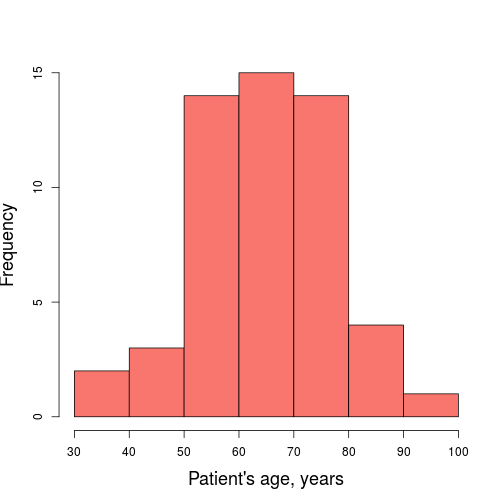
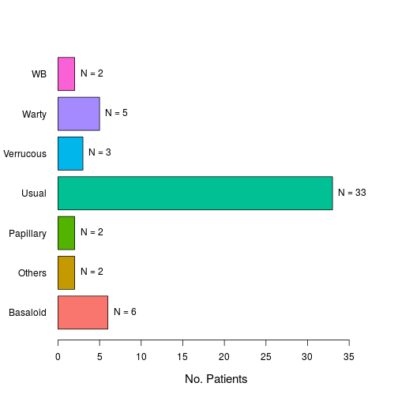
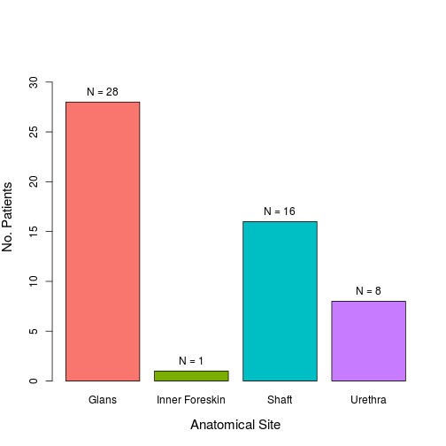
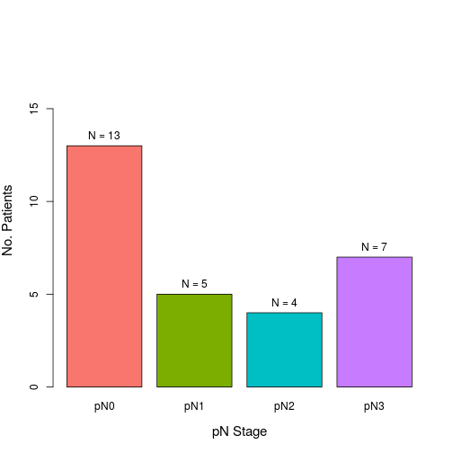
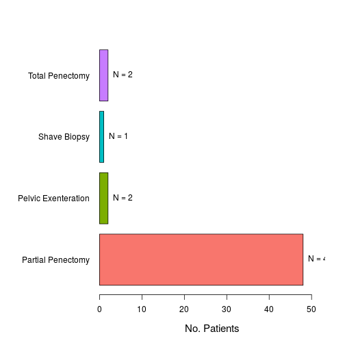

## mTOR in Penile Cancer
Last update: ``Thu Dec 18 14:26:25 2014``


```r
library(knitr)
opts_chunk$set(echo = FALSE, message = FALSE, warning = FALSE, results = "asis")
```


### Descriptive Analysis
In this section we describe the clinicopathologic and outcome features of the dataset. Numerical variables were described using histograms and boxplots. Categorical variables were described using bar plots.

***

#### Patient's age
  

|Statistics          | Values |
|:-------------------|:------:|
|Mean                |  65.8  |
|Standard Deviation  |   12   |
|Median              |   65   |
|Interquartile Range |   18   |
|Mininum             |   38   |
|Maximum             |   93   |

_Number of missing cases:_ 0 cases.

***

#### Patient's race
 

|                 | No. Cases |  %   |
|:----------------|:---------:|:----:|
|African-American |    12     | 22.6 |
|Caucasian        |    37     | 69.8 |
|Other            |     4     |  7.5 |

_Number of missing cases:_ 0 cases.

***

#### Histologic subtype
 

|          | No. Cases |  %   |
|:---------|:---------:|:----:|
|Basaloid  |     6     | 11.3 |
|Others    |     2     |  3.8 |
|Papillary |     2     |  3.8 |
|Usual     |    33     | 62.3 |
|Verrucous |     3     |  5.7 |
|Warty     |     5     |  9.4 |
|WB        |     2     |  3.8 |

_Number of missing cases:_ 0 cases.

***

#### Anatomical site
 

|               | No. Cases |  %   |
|:--------------|:---------:|:----:|
|Glans          |    28     | 52.8 |
|Inner Foreskin |     1     |  1.9 |
|Shaft          |    16     | 30.2 |
|Urethra        |     8     | 15.1 |

_Number of missing cases:_ 0 cases.

***

#### Histologic grade
 

|        | No. Cases | %  |
|:-------|:---------:|:--:|
|Grade 1 |    11     | 21 |
|Grade 2 |    24     | 45 |
|Grade 3 |    18     | 34 |

_Number of missing cases:_ 0 cases.

***

#### Tumor thickness
 

|                | No. Cases | %  |
|:---------------|:---------:|:--:|
|Less than 5 mm  |    21     | 40 |
|5-10 mm         |    16     | 30 |
|More than 10 mm |    16     | 30 |

_Number of missing cases:_ 0 cases.

***

#### Lymphovascular invasion
 

|    | No. Cases | %  |
|:---|:---------:|:--:|
|No  |    36     | 68 |
|Yes |    17     | 32 |

_Number of missing cases:_ 0 cases.

***

#### Perineural invasion
 

|    | No. Cases | %  |
|:---|:---------:|:--:|
|No  |    36     | 68 |
|Yes |    17     | 32 |

_Number of missing cases:_ 0 cases.

***

#### Anatomical level
 

|               | No. Cases |  %   |
|:--------------|:---------:|:----:|
|CC-Skin        |    10     | 19.2 |
|CS-Dartos      |    15     | 28.8 |
|Lamina Propria |    20     | 38.5 |
|Other          |     1     |  1.9 |
|Urethra        |     6     | 11.5 |

_Number of missing cases:_ 1 cases.

***

#### Invasion of penile urethra
 

|    | No. Cases | %  |
|:---|:---------:|:--:|
|No  |    43     | 81 |
|Yes |    10     | 19 |

_Number of missing cases:_ 0 cases.

***

#### Inguinal lymph node metastasis
 

|         | No. Cases | %  |
|:--------|:---------:|:--:|
|Negative |    13     | 45 |
|Positive |    16     | 55 |

_Number of missing cases:_ 24 cases.

***

#### Date of lymph node dissection
  

|Statistics          | Values |
|:-------------------|:------:|
|Mean                |  2.2   |
|Standard Deviation  |  3.8   |
|Median              |   1    |
|Interquartile Range |  1.7   |
|Mininum             |   0    |
|Maximum             |  14.5  |

_Number of missing cases:_ 31 cases.

#### Type of inguinal dissection
 

|              | No. Cases | %  |
|:-------------|:---------:|:--:|
|Post-Surgical |    12     | 55 |
|Prophylactic  |    10     | 45 |

_Number of missing cases:_ 31 cases.

***

#### pT Stage
 

|    | No. Cases |  %   |
|:---|:---------:|:----:|
|Ta  |     1     |  1.9 |
|T1a |    19     | 35.8 |
|T1b |     1     |  1.9 |
|T2  |    22     | 41.5 |
|T3  |     9     | 17.0 |
|T4  |     1     |  1.9 |

_Number of missing cases:_ 0 cases.

***

#### pN Stage
 

|    | No. Cases | %  |
|:---|:---------:|:--:|
|pN0 |    13     | 45 |
|pN1 |     5     | 17 |
|pN2 |     4     | 14 |
|pN3 |     7     | 24 |

_Number of missing cases:_ 24 cases.

***

#### Clinical stage
 

|           | No. Cases |  %   |
|:----------|:---------:|:----:|
|Stage 0    |     1     |  1.9 |
|Stage I    |    18     | 34.0 |
|Stage II   |    18     | 34.0 |
|Stage IIIa |     5     |  9.4 |
|Stage IIIb |     2     |  3.8 |
|Stage IV   |     9     | 17.0 |

_Number of missing cases:_ 0 cases.

***

#### Primary treatment
 

|                    | No. Cases |  %   |
|:-------------------|:---------:|:----:|
|Partial Penectomy   |    48     | 90.6 |
|Pelvic Exenteration |     2     |  3.8 |
|Shave Biopsy        |     1     |  1.9 |
|Total Penectomy     |     2     |  3.8 |

_Number of missing cases:_ 0 cases.

***

#### Adjuvant chemotherapy
 

|    | No. Cases | %  |
|:---|:---------:|:--:|
|No  |    40     | 87 |
|Yes |     6     | 13 |

_Number of missing cases:_ 7 cases.

***

#### Adjuvant radiotherapy
 

|    | No. Cases | %  |
|:---|:---------:|:--:|
|No  |    43     | 88 |
|Yes |     6     | 12 |

_Number of missing cases:_ 4 cases.

***

#### Tumor recurrence
 

|    | No. Cases |  %   |
|:---|:---------:|:----:|
|No  |    40     | 90.9 |
|Yes |     4     |  9.1 |

_Number of missing cases:_ 9 cases.

***

#### Time to tumor recurrence
  

|Statistics          | Values |
|:-------------------|:------:|
|Mean                |  20.5  |
|Standard Deviation  |  23.7  |
|Median              |  13.3  |
|Interquartile Range |  20.8  |
|Mininum             |   1    |
|Maximum             |  54.4  |

_Number of missing cases:_ 49 cases.

***

#### Tumor progression
 

|    | No. Cases | %  |
|:---|:---------:|:--:|
|No  |    29     | 62 |
|Yes |    18     | 38 |

_Number of missing cases:_ 6 cases.

***

#### Time to tumor recurrence
  

|Statistics          | Values |
|:-------------------|:------:|
|Mean                |  9.8   |
|Standard Deviation  |   9    |
|Median              |   6    |
|Interquartile Range |  13.3  |
|Mininum             |  0.2   |
|Maximum             |  31.4  |

_Number of missing cases:_ 39 cases.

***

#### Follow-Up
  

|Statistics          | Values |
|:-------------------|:------:|
|Mean                |  37.2  |
|Standard Deviation  |  43.5  |
|Median              |  17.9  |
|Interquartile Range |  47.2  |
|Mininum             |  0.1   |
|Maximum             | 191.8  |

_Number of missing cases:_ 2 cases.

***

#### Outcome
 

|                      | No. Cases |  %   |
|:---------------------|:---------:|:----:|
|Alive with Disease    |    10     | 18.9 |
|Alive with No Disease |    16     | 30.2 |
|Died of Disease       |    11     | 20.8 |
|Died of other Causes  |    15     | 28.3 |
|No Follow-Up          |     1     |  1.9 |

_Number of missing cases:_ 0 cases.

***

#### Overall mortality
 

|    | No. Cases | %  |
|:---|:---------:|:--:|
|No  |    27     | 53 |
|Yes |    24     | 47 |

_Number of missing cases:_ 2 cases.

***
