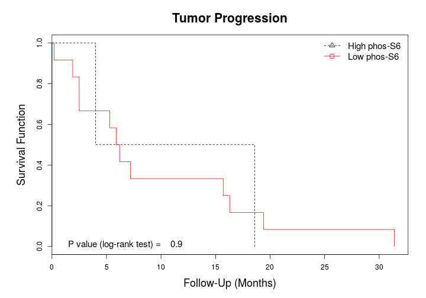
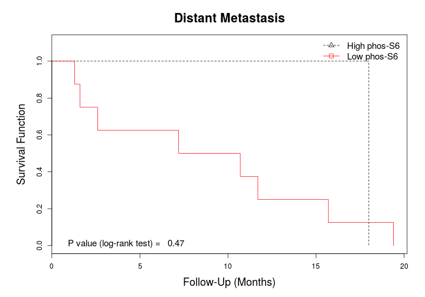
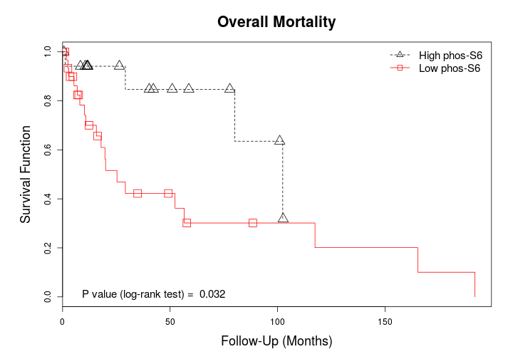
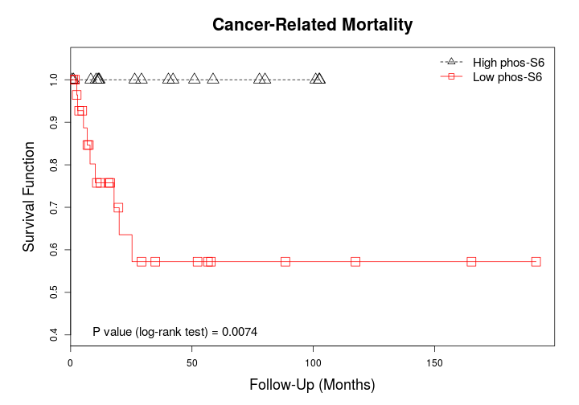

## mTOR in Penile Cancer: phos-S6 expression
Last update: ``Thu Dec 18 14:34:21 2014``


```r
library(knitr)
opts_chunk$set(echo = FALSE, message = FALSE, warning = FALSE, results = "asis")
```


### Description
In this section we evaluate the usefulness of `phos-S6 expression` for predicting outcome, including tumor recurrence, tumor progression, distant metastasis, overall mortality, and cancer-related mortality. The analyses include association tests (Fisher's exact test), survival analysis (Kaplan-Meier method and log-rank test), unconditional binary logistic regression (for estimating odds ratios), and Cox's proportional hazards regression (for estimating hazard ratios). 

__Methodology:__ Immunohistochemical expression was categorized in 2 levels (low and high) using the `upper tertile` as the cutoff point.


***

#### Immunohistochemical expression by H-scores

  

|Statistics          | Values |
|:-------------------|:------:|
|Mean                |   20   |
|Standard Deviation  |  31.8  |
|Median              |   5    |
|Interquartile Range |   21   |
|Mininum             |   0    |
|Maximum             |  120   |

_Number of missing cases:_ 1 cases.

***

#### Immunohistochemical expression by levels

 

|             | No. Cases | %  |
|:------------|:---------:|:--:|
|High phos-S6 |    18     | 35 |
|Low phos-S6  |    34     | 65 |

_Number of missing cases:_ 1 cases.

### Association of Immunohistochemical Expression with Outcome
In this subsection we evaluate the association of levels of immunohistochemical expression with outcome (including tumor recurrence, tumor progression, distant metastasis, overall mortality, and cancer-related mortality) using the Fisher's exact test.

***

#### Tumor recurrence
 

|             |  No  |  %   | Yes |   %   |
|:------------|:----:|:----:|:---:|:-----:|
|High phos-S6 | 13.0 | 33.3 | 4.0 | 100.0 |
|Low phos-S6  | 26.0 | 66.7 | 0.0 |  0.0  |

***

#### Tumor progression
 

|             |  No  |  %   | Yes  |  %   |
|:------------|:----:|:----:|:----:|:----:|
|High phos-S6 | 15.0 | 53.6 | 2.0  | 11.1 |
|Low phos-S6  | 13.0 | 46.4 | 16.0 | 88.9 |

***

#### Distant metastasis
 

|             |  No  |  %   | Yes  |  %   |
|:------------|:----:|:----:|:----:|:----:|
|High phos-S6 | 13.0 | 52.0 | 4.0  | 21.1 |
|Low phos-S6  | 12.0 | 48.0 | 15.0 | 78.9 |

***

#### Overall mortality
 

|             |  No  |  %   | Yes  |  %   |
|:------------|:----:|:----:|:----:|:----:|
|High phos-S6 | 14.0 | 51.9 | 4.0  | 17.4 |
|Low phos-S6  | 13.0 | 48.1 | 19.0 | 82.6 |

***

#### Cancer-related mortality
 

|             | No | %  | Yes |  %  |
|:------------|:--:|:--:|:---:|:---:|
|High phos-S6 | 18 | 45 |  0  |  0  |
|Low phos-S6  | 22 | 55 |  9  | 100 |

***

### Survival Analysis by Immunohistochemical Expression
In this subsection we plot survival curves for levels of immunohistochemical expression by outcome (including tumor progression, distant metastasis, overall mortality, and cancer-related mortality) using the Kaplan-Meier method. Survival curves were compared using the log-rank (Mantel-Cox) test. Tumor recurrence was not included in the analysis due to the lack of events in the low phos-S6 group.

***

 

|             | No. Observations | No. Events | Median Survival |
|:------------|:----------------:|:----------:|:---------------:|
|High phos-S6 |       2.00       |    2.00    |      11.30      |
|Low phos-S6  |      12.00       |   12.00    |      6.05       |

***

 

|             | No. Observations | No. Events | Median Survival |
|:------------|:----------------:|:----------:|:---------------:|
|High phos-S6 |       1.00       |    1.00    |      18.00      |
|Low phos-S6  |       8.00       |    8.00    |      8.95       |

***

 

|             | No. Observations | No. Events | Median Survival |
|:------------|:----------------:|:----------:|:---------------:|
|High phos-S6 |       18.0       |    4.0     |      102.4      |
|Low phos-S6  |       32.0       |    19.0    |      25.3       |

***

 

|             | No. Observations | No. Events | Median Survival |
|:------------|:----------------:|:----------:|:---------------:|
|High phos-S6 |        18        |     0      |       NA        |
|Low phos-S6  |        31        |     9      |       NA        |

***

### Unconditional Binary Logistic Regression
In this subsection we evaluate the usefulness of clinicopathologic features and immunohistochemical expression in predicting outcome (including tumor recurrence, tumor progression, distant metastasis, overall mortality, and cancer-related mortality) using unconditional binary logistic regression models. For each model we report the odds ratio (OR) with its 95% confidence intervals (lower and upper limits), raw P values, and P values adjusted using Hommel's correction.


***

#### Tumor recurrence

|Variables                                   |   OR    | Lower 95% CI | Higher 95% CI | Raw P value | Adjusted P value |
|:-------------------------------------------|:-------:|:------------:|:-------------:|:-----------:|:----------------:|
|Patient's age > median                      |  3.67   |     0.43     |     77.71     |     0.28    |       1.00       |
|Caucasian race                              | 4.3e+07 |   4.4e-161   |      NA       |        1    |       1.00       |
|Glans location                              |  0.67   |    0.074     |     6.02      |      0.7    |       1.00       |
|Invasion limited to lamina propria          |  1e-07  |      NA      |      Inf      |        1    |       1.00       |
|High grade tumor (grade 3)                  |  2e-08  |      NA      |   7.7e+135    |     0.99    |       1.00       |
|Deep invasive tumor (> 10 mm)               |  0.78   |    0.036     |     6.80      |     0.83    |       1.00       |
|Invasion of penile urethra                  | 7.1e-08 |      NA      |   6.2e+120    |     0.99    |       1.00       |
|Lymphovascular invasion                     |  2.08   |     0.23     |     18.95     |     0.49    |       1.00       |
|Perineural invasion                         |  0.69   |    0.032     |     6.02      |     0.76    |       1.00       |
|HPV infection                               |  5.67   |     0.59     |     55.58     |     0.11    |       1.00       |
|High pT stage (> pT1)                       |  0.54   |    0.059     |     4.88      |     0.56    |       1.00       |
|High pN stage (> pN0)                       |  0.75   |    0.027     |     20.72     |     0.85    |       1.00       |
|High clinical stage (> Stage II)            |  0.48   |    0.053     |     4.38      |     0.49    |       1.00       |
|Prophylactic inguinal lymph node dissection | 1.2e+08 |     0.00     |      NA       |        1    |       1.00       |
|Metastatic inguinal lymph nodes             |  0.75   |    0.027     |     20.72     |     0.85    |       1.00       |
|High phos-S6 levels                         | 3.8e-09 |      NA      |   9.6e+169    |        1    |       1.00       |

***

#### Tumor progression

|Variables                                   |   OR    | Lower 95% CI | Higher 95% CI | Raw P value | Adjusted P value |
|:-------------------------------------------|:-------:|:------------:|:-------------:|:-----------:|:----------------:|
|Patient's age > median                      |  1.54   |     0.47     |     5.14      |     0.48    |      0.9900      |
|Caucasian race                              |  1.57   |     0.42     |     6.76      |     0.51    |      0.9900      |
|Glans location                              |  0.23   |     0.06     |     0.76      |     0.02    |      0.1600      |
|Invasion limited to lamina propria          | 2.1e-07 |      NA      |   3.4e+205    |     0.99    |      0.9900      |
|High grade tumor (grade 3)                  |  3.28   |     0.97     |     11.77     |     0.06    |      0.4200      |
|Deep invasive tumor (> 10 mm)               |  22.53  |     5.22     |    130.30     |   0.00011   |      0.0018      |
|Invasion of penile urethra                  |  8.59   |     1.76     |     64.15     |    0.014    |      0.1260      |
|Lymphovascular invasion                     |  4.79   |     1.36     |     18.54     |    0.018    |      0.1440      |
|Perineural invasion                         |  6.00   |     1.64     |     24.74     |   0.0087    |      0.0870      |
|HPV infection                               |  1.79   |     0.37     |     8.66      |     0.46    |      0.9900      |
|High pT stage (> pT1)                       |  18.21  |     3.10     |    350.21     |    0.008    |      0.0852      |
|High pN stage (> pN0)                       |  7.00   |     1.31     |     47.55     |    0.031    |      0.2400      |
|High clinical stage (> Stage II)            |  4e+08  |   1.5e-69    |      NA       |     0.99    |      0.9900      |
|Prophylactic inguinal lymph node dissection |  0.83   |     0.13     |     5.30      |     0.84    |      0.9900      |
|Metastatic inguinal lymph nodes             |  7.00   |     1.31     |     47.55     |    0.031    |      0.2400      |
|High phos-S6 levels                         |  9.23   |     2.10     |     65.70     |   0.0082    |      0.0852      |

***

#### Distant metastasis

|Variables                                   |   OR    | Lower 95% CI | Higher 95% CI | Raw P value | Adjusted P value |
|:-------------------------------------------|:-------:|:------------:|:-------------:|:-----------:|:----------------:|
|Patient's age > median                      |  3.47   |     1.03     |     12.80     |    0.051    |      0.561       |
|Caucasian race                              |  0.96   |     0.27     |     3.56      |     0.95    |      1.000       |
|Glans location                              |  0.53   |     0.16     |     1.75      |      0.3    |      1.000       |
|Invasion limited to lamina propria          | 1.2e-07 |      NA      |    2e+205     |     0.99    |      1.000       |
|High grade tumor (grade 3)                  |  3.70   |     1.06     |     14.11     |    0.045    |      0.495       |
|Deep invasive tumor (> 10 mm)               |  7.56   |     1.99     |     34.27     |   0.0047    |      0.066       |
|Invasion of penile urethra                  |  3.54   |     0.80     |     19.08     |     0.11    |      0.900       |
|Lymphovascular invasion                     |  11.92  |     3.06     |     56.65     |   0.00074   |      0.012       |
|Perineural invasion                         |  2.42   |     0.68     |     9.18      |     0.18    |      1.000       |
|HPV infection                               |  2.74   |     0.58     |     15.08     |     0.21    |      1.000       |
|High pT stage (> pT1)                       |  21.00  |     3.52     |    406.43     |   0.0057    |      0.080       |
|High pN stage (> pN0)                       | 3.8e+09 |   2.2e-147   |      NA       |        1    |      1.000       |
|High clinical stage (> Stage II)            |  5e+08  |   9.9e-75    |      NA       |     0.99    |      1.000       |
|Prophylactic inguinal lymph node dissection |  1.14   |     0.18     |     7.88      |     0.89    |      1.000       |
|Metastatic inguinal lymph nodes             | 3.8e+09 |   2.2e-147   |      NA       |        1    |      1.000       |
|High phos-S6 levels                         |  4.06   |     1.11     |     17.50     |    0.042    |      0.462       |

***

#### Overall mortality

|Variables                                   |   OR    | Lower 95% CI | Higher 95% CI | Raw P value | Adjusted P value |
|:-------------------------------------------|:-------:|:------------:|:-------------:|:-----------:|:----------------:|
|Patient's age > median                      |  1.48   |     0.49     |     4.54      |     0.49    |       1.00       |
|Caucasian race                              |  1.90   |     0.55     |     7.21      |     0.32    |       1.00       |
|Glans location                              |  1.30   |     0.43     |     4.00      |     0.64    |       1.00       |
|Invasion limited to lamina propria          | 1.7e-07 |      NA      |   9.8e+121    |     0.99    |       1.00       |
|High grade tumor (grade 3)                  |  1.00   |     0.31     |     3.23      |        1    |       1.00       |
|Deep invasive tumor (> 10 mm)               |  0.98   |     0.29     |     3.29      |     0.97    |       1.00       |
|Invasion of penile urethra                  |  4.17   |     0.85     |     30.74     |      0.1    |       1.00       |
|Lymphovascular invasion                     |  1.43   |     0.43     |     4.90      |     0.56    |       1.00       |
|Perineural invasion                         |  1.42   |     0.44     |     4.68      |     0.55    |       1.00       |
|HPV infection                               |  1.15   |     0.24     |     5.45      |     0.86    |       1.00       |
|High pT stage (> pT1)                       |  0.82   |     0.26     |     2.55      |     0.74    |       1.00       |
|High pN stage (> pN0)                       |  0.64   |     0.14     |     2.93      |     0.57    |       1.00       |
|High clinical stage (> Stage II)            |  0.98   |     0.31     |     3.09      |     0.97    |       1.00       |
|Prophylactic inguinal lymph node dissection |  0.80   |     0.13     |     4.58      |      0.8    |       1.00       |
|Metastatic inguinal lymph nodes             |  0.64   |     0.14     |     2.93      |     0.57    |       1.00       |
|High phos-S6 levels                         |  5.12   |     1.47     |     21.37     |    0.015    |       0.24       |

***

#### Cancer-related mortality

|Variables                                   |   OR    | Lower 95% CI | Higher 95% CI | Raw P value | Adjusted P value |
|:-------------------------------------------|:-------:|:------------:|:-------------:|:-----------:|:----------------:|
|Patient's age > median                      |  2.32   |     0.53     |     12.18     |     0.28    |       1.00       |
|Caucasian race                              |  1e+08  |   4.1e-96    |      NA       |     0.99    |       1.00       |
|Glans location                              |  0.63   |     0.14     |     2.70      |     0.53    |       1.00       |
|Invasion limited to lamina propria          | 3.7e-07 |      NA      |   4.8e+205    |        1    |       1.00       |
|High grade tumor (grade 3)                  |  3.02   |     0.69     |     14.16     |     0.14    |       1.00       |
|Deep invasive tumor (> 10 mm)               |  7.11   |     1.56     |     39.44     |    0.014    |       0.20       |
|Invasion of penile urethra                  |  7.40   |     1.38     |     42.26     |    0.019    |       0.25       |
|Lymphovascular invasion                     |  7.11   |     1.56     |     39.44     |    0.014    |       0.20       |
|Perineural invasion                         |  5.45   |     1.22     |     29.60     |    0.032    |       0.42       |
|HPV infection                               |  1.67   |     0.21     |     9.18      |     0.58    |       1.00       |
|High pT stage (> pT1)                       |  6.91   |     1.12     |    134.24     |    0.081    |       0.81       |
|High pN stage (> pN0)                       |  2.86   |     0.55     |     17.52     |     0.22    |       1.00       |
|High clinical stage (> Stage II)            | 1.3e+08 |   3.5e-81    |      NA       |     0.99    |       1.00       |
|Prophylactic inguinal lymph node dissection |  1.00   |     0.14     |     7.16      |        1    |       1.00       |
|Metastatic inguinal lymph nodes             |  2.86   |     0.55     |     17.52     |     0.22    |       1.00       |
|High phos-S6 levels                         | 1.3e+08 |   1.3e-83    |      NA       |     0.99    |       1.00       |

***

### Cox's Proportional Hazards Regression
In this subsection we evaluate the usefulness of clinicopathologic features and immunohistochemical expression in predicting outcome (including tumor recurrence, tumor progression, distant metastasis, overall mortality, and cancer-related mortality) using unadjusted Cox's proportional hazard regression models. For each model we report the hazard ratio (HR) with its 95% confidence intervals (lower and upper limits), raw P values, and P values adjusted using Hommel's correction.

***

#### Tumor recurrence

|Variables                                   |   HR    | Lower 95% CI | Higher 95% CI | Raw P value | Adjusted P value |
|:-------------------------------------------|:-------:|:------------:|:-------------:|:-----------:|:----------------:|
|Patient's age > median                      |  2.65   |     0.38     |     0.26      |     0.38    |       0.97       |
|Caucasian race                              | 3.5e+08 |   2.9e-09    |     0.00      |     0.12    |       0.96       |
|Glans location                              |  1.04   |     0.96     |     0.14      |     0.97    |       0.97       |
|Invasion limited to lamina propria          | 1.3e-08 |     1.12     |    1.3e-08    |     0.92    |       0.97       |
|High grade tumor (grade 3)                  | 3.4e-09 |   2.9e+08    |     0.00      |     0.27    |       0.97       |
|Deep invasive tumor (> 10 mm)               |  3.78   |     0.26     |     0.31      |     0.34    |       0.97       |
|Invasion of penile urethra                  | 1.3e-08 |   7.9e+07    |     0.00      |     0.54    |       0.97       |
|Lymphovascular invasion                     |  7.19   |     0.14     |     0.60      |     0.11    |       0.88       |
|Perineural invasion                         |  3.78   |     0.26     |     0.31      |     0.34    |       0.97       |
|HPV infection                               |  7.88   |     0.13     |     0.68      |    0.088    |       0.79       |
|High pT stage (> pT1)                       |  4.48   |     0.22     |     0.32      |     0.25    |       0.97       |
|High pN stage (> pN0)                       |  1.21   |     0.83     |     0.073     |      0.9    |       0.97       |
|High clinical stage (> Stage II)            |  4.48   |     0.22     |     0.32      |     0.25    |       0.97       |
|Prophylactic inguinal lymph node dissection | 2.9e+09 |   3.5e-10    |     0.00      |     0.17    |       0.97       |
|Metastatic inguinal lymph nodes             |  1.21   |     0.83     |     0.073     |      0.9    |       0.97       |
|High phos-S6 levels                         | 5.3e-10 |   1.9e+09    |     0.00      |    0.015    |       0.24       |

***

#### Tumor progression

|Variables                                   |   HR    | Lower 95% CI | Higher 95% CI | Raw P value | Adjusted P value |
|:-------------------------------------------|:-------:|:------------:|:-------------:|:-----------:|:----------------:|
|Patient's age > median                      |  1.24   |     0.81     |     0.47      |     0.66    |     9.1e-01      |
|Caucasian race                              |  2.01   |     0.50     |     0.58      |     0.24    |     7.2e-01      |
|Glans location                              |  0.46   |     2.18     |     0.17      |     0.12    |     4.8e-01      |
|Invasion limited to lamina propria          | 8.9e-08 |     1.56     |     5.25      |    0.062    |     3.1e-01      |
|High grade tumor (grade 3)                  |  3.23   |     0.31     |     1.18      |    0.022    |     1.7e-01      |
|Deep invasive tumor (> 10 mm)               |  11.92  |    0.084     |     4.00      |   2.5e-06   |     3.8e-05      |
|Invasion of penile urethra                  |  4.73   |     0.21     |     1.66      |   0.0075    |     8.2e-02      |
|Lymphovascular invasion                     |  3.01   |     0.33     |     1.15      |    0.027    |     1.9e-01      |
|Perineural invasion                         |  6.67   |     0.15     |     2.44      |   0.00024   |     3.1e-03      |
|HPV infection                               |  1.07   |     0.93     |     0.35      |     0.91    |     9.1e-01      |
|High pT stage (> pT1)                       |  21.62  |    0.046     |     2.70      |   2.1e-05   |     2.9e-04      |
|High pN stage (> pN0)                       |  3.16   |     0.32     |     0.97      |    0.042    |     2.5e-01      |
|High clinical stage (> Stage II)            | 2.4e+09 |   4.2e-10    |     0.00      |   3.4e-07   |     5.4e-06      |
|Prophylactic inguinal lymph node dissection |  2.84   |     0.35     |     0.74      |     0.13    |     4.8e-01      |
|Metastatic inguinal lymph nodes             |  3.16   |     0.32     |     0.97      |    0.042    |     2.5e-01      |
|High phos-S6 levels                         |  6.44   |     0.16     |     1.47      |   0.0023    |     2.8e-02      |

***

#### Distant metastasis

|Variables                                   |   HR    | Lower 95% CI | Higher 95% CI | Raw P value | Adjusted P value |
|:-------------------------------------------|:-------:|:------------:|:-------------:|:-----------:|:----------------:|
|Patient's age > median                      |  2.03   |     0.49     |     0.75      |     0.16    |     5.6e-01      |
|Caucasian race                              |  1.44   |     0.70     |     0.47      |     0.52    |     5.6e-01      |
|Glans location                              |  0.75   |     1.33     |     0.29      |     0.56    |     5.6e-01      |
|Invasion limited to lamina propria          | 4.2e-08 |     1.15     |     2.51      |     0.48    |     5.6e-01      |
|High grade tumor (grade 3)                  |  3.40   |     0.29     |     1.25      |    0.017    |     1.4e-01      |
|Deep invasive tumor (> 10 mm)               |  7.67   |     0.13     |     2.77      |   9.8e-05   |     1.4e-03      |
|Invasion of penile urethra                  |  2.81   |     0.36     |     0.89      |     0.11    |     5.5e-01      |
|Lymphovascular invasion                     |  4.97   |     0.20     |     1.82      |   0.0013    |     1.4e-02      |
|Perineural invasion                         |  4.71   |     0.21     |     1.76      |   0.0034    |     3.4e-02      |
|HPV infection                               |  1.38   |     0.72     |     0.48      |     0.55    |     5.6e-01      |
|High pT stage (> pT1)                       |  22.74  |    0.044     |     2.86      |   1.3e-05   |     1.9e-04      |
|High pN stage (> pN0)                       |  8.35   |     0.12     |     1.85      |   0.00066   |     7.8e-03      |
|High clinical stage (> Stage II)            | 2.5e+09 |    4e-10     |     0.00      |   1.8e-07   |     2.9e-06      |
|Prophylactic inguinal lymph node dissection |  3.70   |     0.27     |     1.02      |    0.044    |     3.1e-01      |
|Metastatic inguinal lymph nodes             |  8.35   |     0.12     |     1.85      |   0.00066   |     7.8e-03      |
|High phos-S6 levels                         |  2.95   |     0.34     |     0.96      |    0.042    |     2.9e-01      |

***

#### Overall mortality

|Variables                                   |   HR    | Lower 95% CI | Higher 95% CI | Raw P value | Adjusted P value |
|:-------------------------------------------|:-------:|:------------:|:-------------:|:-----------:|:----------------:|
|Patient's age > median                      |  1.13   |     0.88     |     0.49      |     0.77    |      0.930       |
|Caucasian race                              |  1.59   |     0.63     |     0.58      |     0.35    |      0.930       |
|Glans location                              |  1.64   |     0.61     |     0.70      |     0.25    |      0.930       |
|Invasion limited to lamina propria          | 5.2e-08 |     0.29     |     3.12      |   0.0069    |      0.083       |
|High grade tumor (grade 3)                  |  2.22   |     0.45     |     0.87      |      0.1    |      0.700       |
|Deep invasive tumor (> 10 mm)               |  3.63   |     0.28     |     1.32      |    0.018    |      0.180       |
|Invasion of penile urethra                  |  4.71   |     0.21     |     1.71      |   0.0068    |      0.082       |
|Lymphovascular invasion                     |  2.27   |     0.44     |     0.89      |    0.093    |      0.693       |
|Perineural invasion                         |  5.34   |     0.19     |     1.97      |   0.0015    |      0.022       |
|HPV infection                               |  1.05   |     0.95     |     0.35      |     0.93    |      0.930       |
|High pT stage (> pT1)                       |  4.43   |     0.23     |     1.43      |   0.0044    |      0.053       |
|High pN stage (> pN0)                       |  1.28   |     0.78     |     0.38      |     0.69    |      0.930       |
|High clinical stage (> Stage II)            |  6.29   |     0.16     |     1.78      |   0.00085   |      0.013       |
|Prophylactic inguinal lymph node dissection |  2.29   |     0.44     |     0.55      |     0.26    |      0.930       |
|Metastatic inguinal lymph nodes             |  1.28   |     0.78     |     0.38      |     0.69    |      0.930       |
|High phos-S6 levels                         |  3.12   |     0.32     |     1.04      |    0.025    |      0.250       |

***

#### Cancer-related mortality

|Variables                                   |   HR    | Lower 95% CI | Higher 95% CI | Raw P value | Adjusted P value |
|:-------------------------------------------|:-------:|:------------:|:-------------:|:-----------:|:----------------:|
|Patient's age > median                      |  2.01   |     0.50     |     0.50      |     0.31    |      0.8550      |
|Caucasian race                              | 3.4e+08 |    3e-09     |     0.00      |   0.0085    |      0.0800      |
|Glans location                              |  0.69   |     1.46     |     0.18      |     0.57    |      0.9500      |
|Invasion limited to lamina propria          | 5.7e-08 |     0.39     |     6.24      |    0.027    |      0.2160      |
|High grade tumor (grade 3)                  |  3.10   |     0.32     |     0.83      |    0.095    |      0.5400      |
|Deep invasive tumor (> 10 mm)               |   9.96  |     0.10     |     2.28      |   0.0015    |      0.0196      |
|Invasion of penile urethra                  |  6.30   |     0.16     |     1.65      |    0.013    |      0.1170      |
|Lymphovascular invasion                     |  5.14   |     0.19     |     1.28      |    0.016    |      0.1280      |
|Perineural invasion                         |  8.50   |     0.12     |     1.99      |   0.0028    |      0.0364      |
|HPV infection                               |  1.05   |     0.95     |     0.22      |     0.95    |      0.9500      |
|High pT stage (> pT1)                       |  8.98   |     0.11     |     1.11      |   0.0086    |      0.0800      |
|High pN stage (> pN0)                       |  2.63   |     0.38     |     0.62      |     0.18    |      0.7200      |
|High clinical stage (> Stage II)            | 1.8e+09 |   5.5e-10    |     0.00      |   0.00029   |      0.0046      |
|Prophylactic inguinal lymph node dissection |  1.96   |     0.51     |     0.39      |     0.42    |      0.8550      |
|Metastatic inguinal lymph nodes             |  2.63   |     0.38     |     0.62      |     0.18    |      0.7200      |
|High phos-S6 levels                         | 4.9e+08 |    2e-09     |     0.00      |   0.0012    |      0.0168      |

***
